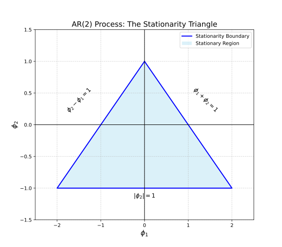

The $AR(p)$ model is expressed as:

\[
Y_t = c + \phi_1Y_{t-1} + \phi_2Y_{t-2} + \cdot \cdot \cdot \ + \phi_pY_{t-p} + \epsilon_t
\]

An interesting thing is noted with this expression. When compared with the model for linear regression:

\[
Y = \beta_0 + \beta_1X_1 + \beta_2X_2 + \cdot \cdot \cdot \ + \beta_kX_k + \epsilon
\]

They are structurally identical. The values $\beta_k$ of a linear regression are computed from the data effectively acting as weights that determine the effect of a specific variable $X_k$ on the outcome. This similar to how the values $\phi_k$ of an autoregressive model are essentially weights that must satisfy the requirement that all roots ($B$) of the characteristic equation must lie outside the unit circle in the complex plane for the series to be stationary. And the values $Y_{t-k}$ are past observations.

Let's explore $\phi_{k}$. Using the [[Mathematical Proofs#Backshift Operator|Backshift Operator]] any $AR(p)$ model can be expressed as:

\[
BY_t = Y_{t-1}
\]

In a simple $AR(1)$ model there is only one root. Therefore, the condition is simply:

\[
|\phi_1| < 1
\]

The absolute value of $\phi_1$ should be less than one in order to prevent the model from experiencing a runaway either in the positive or negative direction. In the model:

\[
Y_t = c + \phi_1Y_{t-1} + \epsilon_t
\]

If the absolute value of $\phi_1$ is larger than 1 and positive this will cause the value of $Y_t$ to continuously grow very large. Given that $\phi_1 = 1$ and $\epsilon_t$ is white noise with a mean of 0 thus can be [[Mathematical Proofs#White Noise|disregarded]] for this proof.

| Step (t)     | Explosive (phi = 1.5)   | Stationary (phi = 0.5)      |
| :----------- | :---------------------- | :-------------------------- |
| **Formula**  | $Y_t = 2 + 1.5 Y_{t-1}$ | $Y_t = 2 + 0.5 Y_{t-1}$     |
| **$Y_0$**    | 1.000                   | 1.000                       |
| **$Y_1$**    | 3.500                   | 2.500                       |
| **$Y_2$**    | 7.250                   | 3.250                       |
| **$Y_3$**    | 12.875                  | 3.625                       |
| **$Y_4$**    | 21.312                  | 3.812                       |
| **$Y_5$**    | 33.968                  | 3.906                       |
| **$Y_{10}$** | 175.341                 | 3.997                       |
| **Long-run** | **Diverges** ($\infty$) | **Converges** ($\mu = 4.0$) |

The convergence to 4 is from the [[Mathematical Proofs#Negating White Noise in AR Model|long run mean proof]]:

\[
\mu = \frac{c}{1 - \phi} = \frac{2}{1 - 0.5} = 4
\]

If we increase the autoregressive order to 2, an $AR(2)$ model needs to satisfy three conditions:

\[
\phi_1 + \phi_2 < 1
\]

\[
\phi_2 - \phi_1 < 1
\]

\[
\phi_2 < 1
\]

This forms a stationarity triangle within which both values must fall for the distribution to be stationary.

These values correlate with the roots $z_1$ and $z_2$ obtained from solving the characteristic equation $1 - \phi_1z - \phi_2z^2$. The coefficients are tied to the roots:

\[
\phi_1 = \frac{1}{z_1} + \frac{1}{z_2}
\]

\[
\phi_2 = \frac{1}{z_1z_2}
\]

The coefficients are symmetric functions of the inverse roots. This results from the roots being computed from the characteristic equation:

\[
1 - \phi_1B - \phi_2B^2 = 0
\]

This is from the $AR(2)$ model:

\[
Y_t = \phi_1Y_{t-1} + \phi_2Y_{t-2} + \epsilon_t
\]

\[
Y_t - \phi_1Y_{t-1} + \phi_2Y_{t-2} = \epsilon_t
\]

\[
Y_t - \phi_1BY_t + \phi_2B^2Y_t = \epsilon_t
\]

\[
(1 - \phi_1B - \phi_2B^2)Y_t = \epsilon_t
\]

To prove the coefficients being tied to the roots [[Mathematical Proofs#Vieta's Formulas for $AR(2)$ Model|Vieta's Formulas]]  are employed. In higher order $AR(p)$ models the logic of the roots of the characteristic equation being outside the unit circle is employed with the coefficients correlating in more complex manners.
